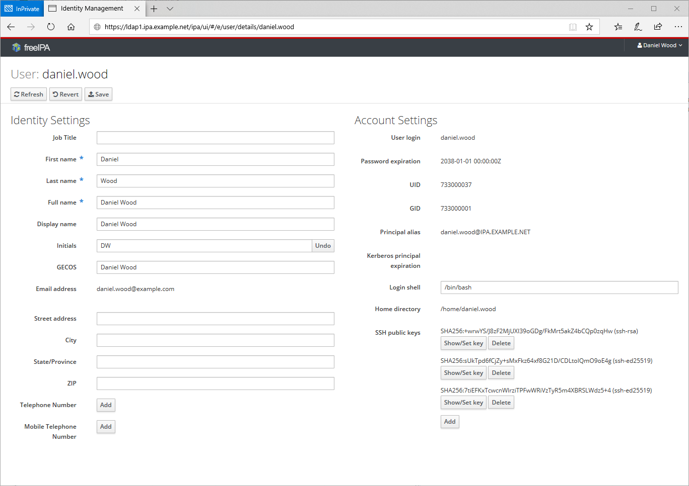

# user-self-service.js plugin for FreeIPA
## Overview
This plugin will modify the default user view to just a few select fields that they can view/edit after logging in. Comment out/remove fields in the js to restrict the user view even further.

## Install
On each FreeIPA server:
```bash
mkdir -p /usr/share/ipa/ui/js/plugins/user-self-service
curl --output /usr/share/ipa/ui/js/plugins/user-self-service/user-self-service.js \
     --url https://raw.githubusercontent.com/danielewood/misc/master/FreeIPA/plugins/user-self-service/user-self-service.js
```

## Results

